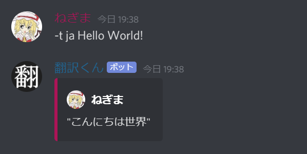

TranslaterBot "翻訳くん"
===
This program is a message translation DiscordBot that uses Heroku.
It can translate Discord messages using Google Translate.

## Demo


## Requirement
```
python-3.8.8
discord.py
requests
```

## Usage
1. Create a DiscordBot and get an access token. (https://discord.com/developers/applications)
2. Place `script/main.gs` in GoogleAppScript so that it can be run as a web application.
3. Deploy this application to Heroku. (https://dashboard.heroku.com/apps)
4. Set the access token of DiscordBot and the application URL of GoogleAppScript to Heroku environment variables.
   ```
   ACCESS_TOKEN = *************************************
   TRANSAPI_URL = https://script.google.com/macros/**************/exce
   ```
5. Turn on discordbot's Dyno on Heroku.

## Commends
```
-t [lang] [text]
lang... ja en zh_CN
lang... Japanese Chinese English
lang... 🇨🇳 🇺🇸 🇯🇵 (only)

-t help
-t author
```
You can also use it from the command or by adding a flag reaction to the message.


## Licence
Under the [MIT Licence](LICENCE.md)

## Author
[Negima1072](https://twitter.com/Negima1072)

Copyright (c) 2021 Negima1072.